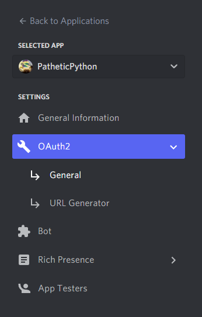
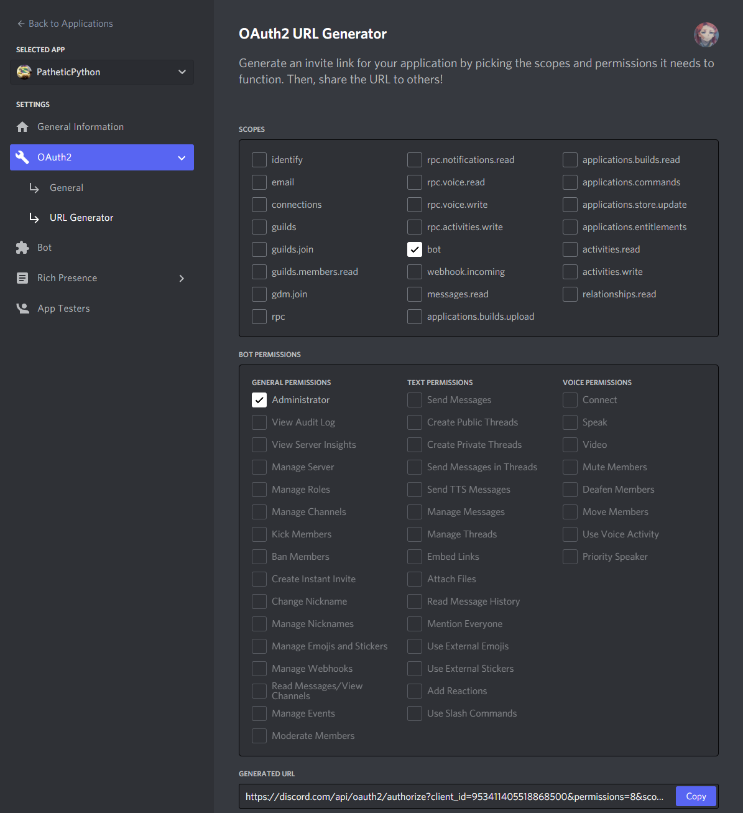

# Pathetic Python Bot for Discord

V. 1

Simple bot that provides humor and sarcasm in a Discord text channel.
Hosted through AWS EC2.

## To invite Pathetic Python to your server:
[Pathetic Python](https://discord.com/api/oauth2/authorize?client_id=953411405518868500&permissions=8&scope=bot)

More features coming soon. 

**UPDATE** April 30th 2022 Pathetic Python and other bots that rely on message content will no longer be able to become verified bots without message intent approval. This will only significantly affect bots who are present in > 75 servers. [Read more here](https://support-dev.discord.com/hc/en-us/articles/4404772028055)

## How to create your own Discord bot: 

1. Create a [Discord](https://discord.com/) account. 
2. Create a Discord server to test bot in. Must have 'Manage Server' permissions to invite bots. 
3. Create an application in [Discord Developer Portal](https://discord.com/developers/applications)
4. Create bot -- the default name will be inherited from the app name, but this can be changed. 
   IMPORTANT! Make sure to copy the token when creating your bot, this is how you will connect your code to Discord.
   You can reset this if you lose it or there are security vulnerabilites. 
5. To invite your bot to a server, find 'OAuth2'



6. Select 'Bot' from scopes, then select permissions necessary. For testing on a personal server, I recommend admin. 



7. Copy link into browser, and invite to server you will be testing on. 
8. Create a bot.py file. Bot code: [here](/bot.py)

### Requirements
Make sure to install Discord and ENV:
```
python3 -m pip install --user virtualenv
python3 -m pip install -U discord.py
```
For security, create a .env file to contain your Discord Bot token.
```
DISCORD_TOKEN = "{insert-your-token-here}"
```
9. At this point, you can test on your local machine (Windows)
```
python3 -m bot.py
```
10. The bot will stay online while your Python application is running locally. To host in the cloud using AWS, follow steps 11 - ?.

###Hosting in [AWS](https://aws.amazon.com/)
12. Create an instance in AWS EC2. For basic purposes, their free tier Linux works perfect. Save the .PEM file when creating instance for connecting via SSH.
13. Using PUTTYGen, create .PPK file from .PEM. Install PUTTY [here](https://www.chiark.greenend.org.uk/~sgtatham/putty/latest.html)
14. Using PUTTY, connect to server using the public facing IP address and your PPK file.
15. Repeat step 8 to upload your bot code into the cloud. 
16. To run the bot continuously, use 
```
nohup python3 -m bot.py
```
